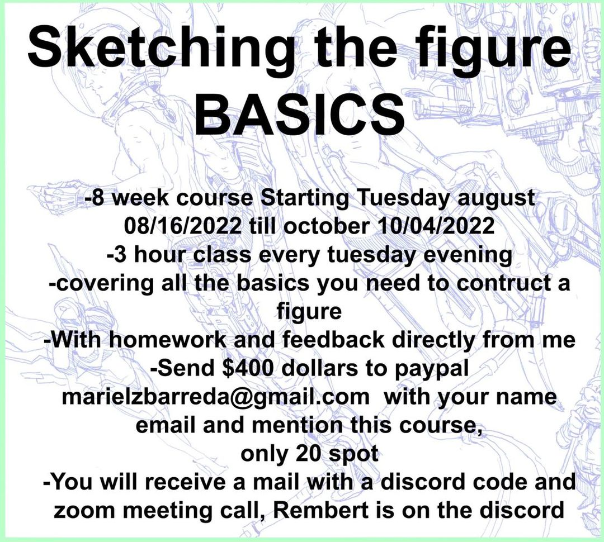
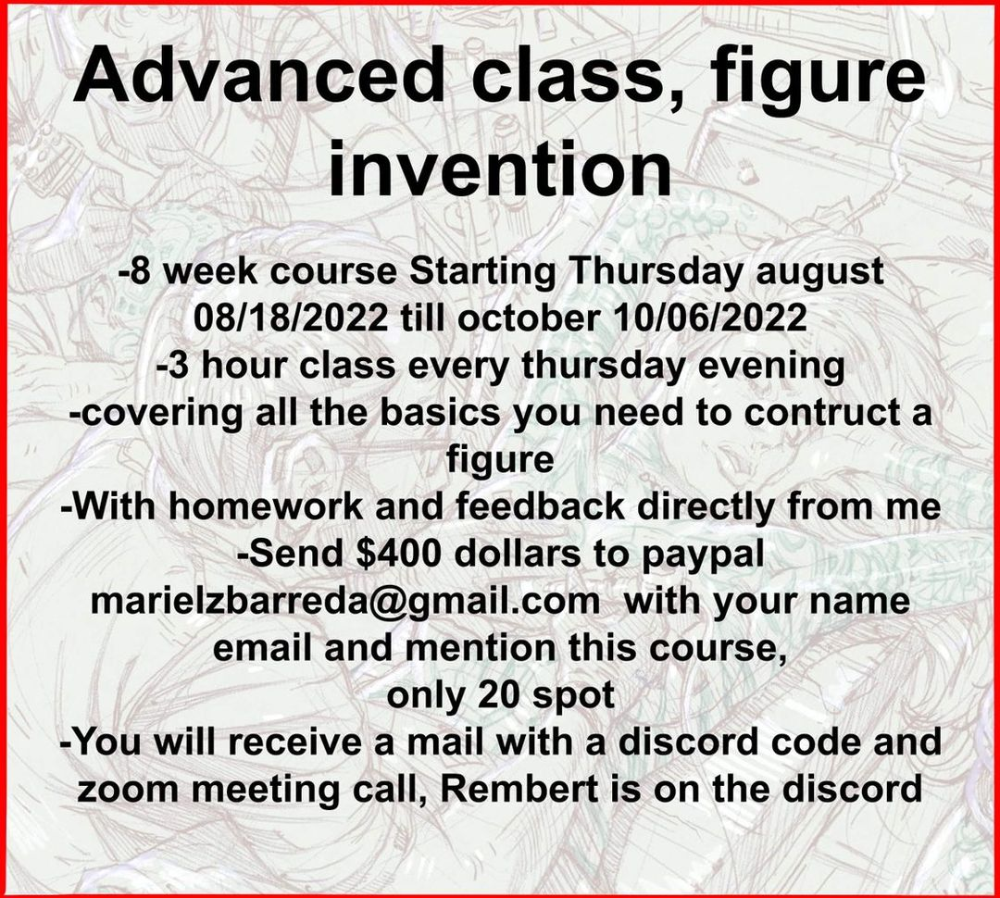
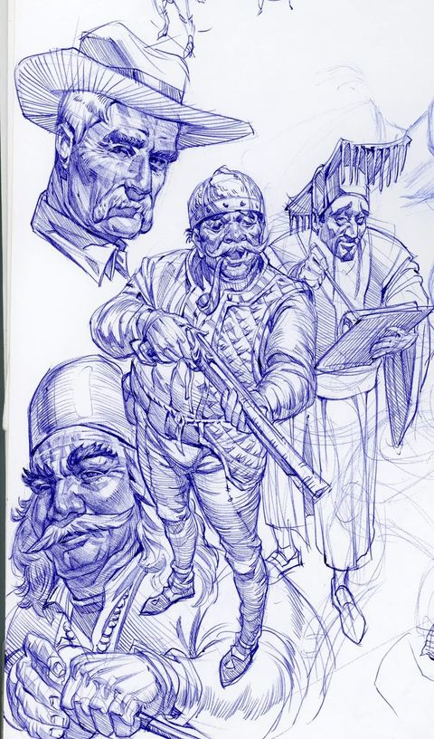
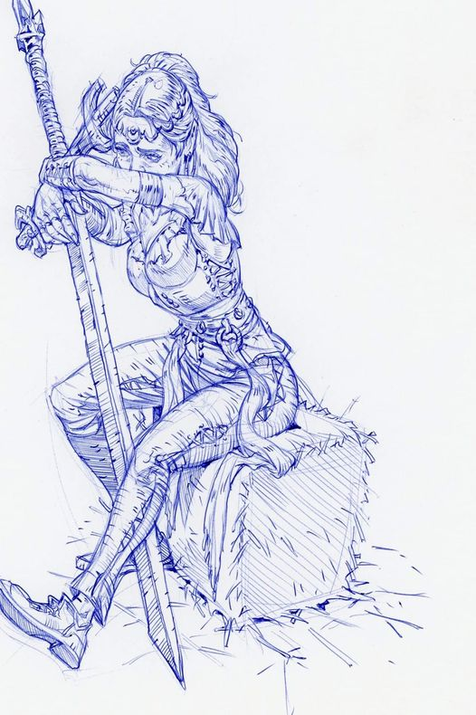

# rembert-montald-sketching-the-figure

Rembert Montald's Sketching the figure class.

In the basic course, I’ll teach drawing skills, movement, proportions of the mannequin, posing, anatomy etc.

In the advance class, we will do more finished sketches from imagination without reference like these ones.

